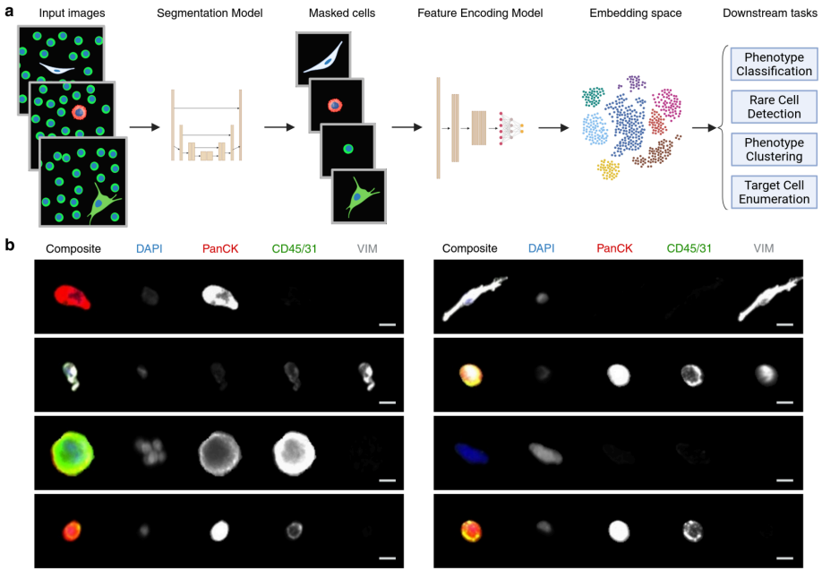

# **Contrastive Representation Learning for Single Cell Phenotyping in Whole Slide Imaging of Enrichment-free Liquid Biopsy**

## **Overview**

This work develops a **deep contrastive learning framework** for identifying and stratifying single cells in whole slide immunofluorescence microscopy images derived from liquid biopsies.

Tumor-associated cells obtained from liquid biopsies hold promise for **cancer detection, diagnosis, prognosis, and monitoring**. However, their **rarity, heterogeneity, and plasticity** pose challenges for precise identification and characterization, particularly in clinical contexts.



Overview of the Work and A Gallery of Cells Found in Enrichment-Free Liquid Biopsies


Model Training Schema

## **Key Contributions**

* **Robust Cell Identification:**
  Introduces a deep contrastive learning framework to robustly identify and classify circulating cells from whole slide images.

* **High Classification Accuracy:**
  Demonstrates **high accuracy (92.64%)** in classifying diverse cell phenotypes.

* **Enhanced Downstream Performance:**
  Improves the performance of downstream tasks, including **outlier detection and clustering**.

* **Automated Rare Cell Identification:**
  Enables automated identification and enumeration of distinct rare cell phenotypes, achieving:

  * **Average F1-score of 0.93** across cell lines mimicking circulating tumor cells and endothelial cells.
  * **Average F1-score of 0.858** across circulating tumor cell (CTC) phenotypes in clinical samples.

* **Scalable Analysis Pipeline:**
  Provides a scalable analysis pipeline for tumor-associated cellular biomarkers, facilitating **clinical prognosis and personalized treatment strategies**.

---

### **USAGE**

This code was developed on Linux machinery and has only been adequately tested on Ubuntu 22.04. 

Installation of github version

1. Clone this repository
```
git@github.com:CSI-Cancer/deep_phenotyping.git
cd deep_phenotyping
```

2. Create conda environment:
```
conda create -n deep_phenotyping python=3.9.7
conda activate deep_phenotyping
pip install -r requirements.txt
```

a. Run Model Training on Data (train_cl.py)

b. Run pipeline in terminal 
```
pipeline/run.sh

```
---

## **Directory Structure**

```
project_root/
├── figures/                # Notebooks and scripts for figure generation and analysis
├── pipeline/               # Pipeline for running the model on whole slide images
├── src/                    # Core code for representation learning and classification
├── train_data/             # Datasets used for training the models
└── README.md               # Project documentation
```

---

### **Figures Directory (`figures/`)**

Contains subdirectories with notebooks and scripts to generate figures for the manuscript. Each subdirectory corresponds to a figure and may contain:

* **Data Folders:** Processed data used to generate specific plots. **This data is available upon request**
* **Jupyter Notebooks:** Scripts to generate the figures.
* **Output Files:** PDF and image files of the figures.

#### **Subdirectories:**

* `figure2/`: Classification performance (e.g., confusion matrices, precision-recall curves).
* `figure3_blur/`: Blur robustness analysis.
* `figure4_clustering/`: Clustering performance visualization.
* `figure5_outlierdetection/`: Outlier detection evaluation.
* `figure6_spikein/`: Spike-in experiments and analysis.
* `figure7_patient/`: Patient-specific analysis and figures.
* `segmentation_test/`: Testing segmentation algorithms.

---

### **Pipeline Directory (`pipeline/`)**

Contains scripts and configurations to process whole slide images through the deep learning model.

#### **Subdirectories:**

* **config/**: Configuration files for model and pipeline settings.
* **metadata/**: Input data descriptions and sample metadata. **This metadata is created when running the utility scripts**
* **model\_weights/**: Pretrained model weights. **These weights are available upon request**
* **output/**: Contains the output of pipeline runs, separated by patients and spike-in experiments. **Outputs are created upon running the pipeline**
* **src/**: Scripts to execute the pipeline (e.g., `pipeline.py`, `combo_pipeline.py`).
* **utils\_scripts/**: Auxiliary scripts, such as collecting slide metadata.

#### **Key Files:**

* `run.sh`, `runcombo.sh`, `run_wbc.sh`: Scripts to execute the pipeline with various configurations.
* `Snakefile`, `SnakefileCombo`, `SnakefileWBC`: Snakemake workflows for different data types.

---

### **Source Code Directory (`src/`)**

This directory houses the core scripts for both **representation learning** and **leukocyte classification**.

#### **Subdirectories:**

1. **leukocyte\_classifier/**

   * Contains scripts for classifying leukocytes and related cell types.
   * **Scripts:**

     * `train_wbc.py`: Train the leukocyte classifier.
     * `wbc_classifier.py`: Main clapip install -r requirements.txtntrastive learning model architecture.
     * `data_loader.py`: Data handling and loading functions.
     * `cl_transforms.py`: Data augmentation and transformation functions.
   * **Configuration:**

     * `config/config.yml`: Main configuration file for contrastive learning.
     * `config/sweep_config.yml`: Configuration for hyperparameter sweeps.

3. **utils/**pip install -r requirements.txtning the models, including representation learning and leukocyte classification. **This data is available upon request.** 

#### **Subdirectories:**

* **representation\_learning/**: Training data for the contrastive learning model.

* **wbc\_classifier/**: Data specific to white blood cell classification.

---

## **License**

This project is licensed under the Apache License. See the [LICENSE](LICENSE) file for details.

---

## **Contact**

For questions or collaboration, please contact the project maintainers through the GitHub repository's issue tracker.